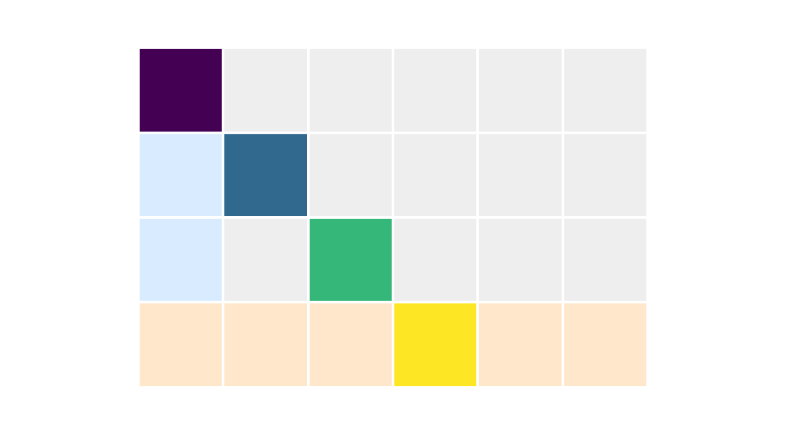
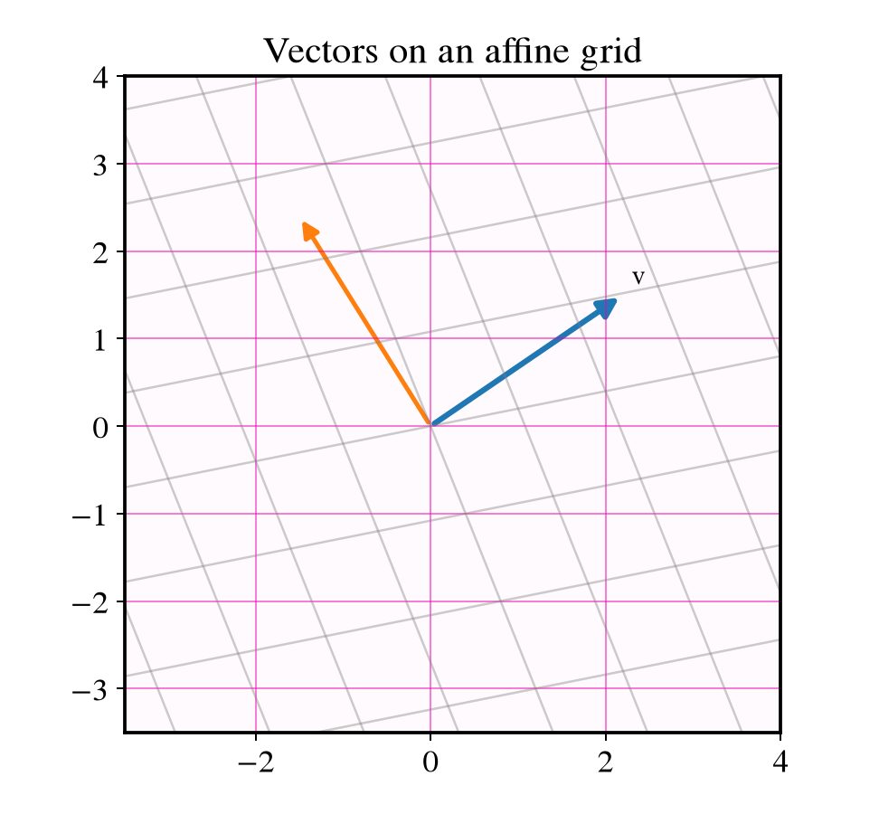
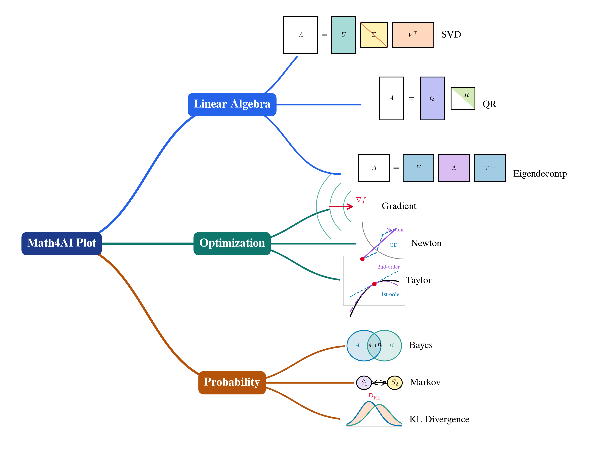

# Math4AI

**Math4AI** is a Python toolkit for creating publication-ready mathematics and machine learning figures with a consistent visual language.

It is designed for long-form projects (books, lecture notes, technical reports) where figure style consistency matters across dozens or hundreds of scripts.

## What Math4AI provides

- Shared color tokens for geometric and algebraic diagrams
- Matrix drawing primitives with row/column/diagonal highlighting
- Vector helpers for arrows and affine grids
- Figure output helpers aligned with chapter-script workflows
- JSON-driven mindmap rendering with built-in and local custom icons
- A large icon set for linear algebra, optimization, probability, and diffusion topics

## Quick install

```bash
pip install math4ai
```

Sanity check:

```bash
python -c "from math4ai import plane_color; print(plane_color)"
```

## Visual output examples

### Matrix highlighting



### Vector and affine grid



### Mindmap rendering



## Documentation map

| Section | Contents |
|---|---|
| [What is Math4AI?](what-is-math4ai.md) | Scope, goals, and design principles |
| [Installation](installation.md) | PyPI and editable install |
| [Quick start](quickstart.md) | Minimal working examples |
| [Python API overview](python-api.md) | Public API categories |
| [Colors](colors.md) | Shared color constants |
| [Matrix visualization](matrix-visualization.md) | `Matrix` class and helper functions |
| [Vector visualization](vector-visualization.md) | Grid and arrow drawing helpers |
| [Figure utilities](figure-utilities.md) | Save and styling helpers |
| [Mindmaps](mindmaps.md) | `mindmap.json` schema and rendering |
| [Icons reference](icons-reference.md) | Built-in icon names for mindmaps |
| [System requirements](system-requirements.md) | Platform, Python, and dependencies |
